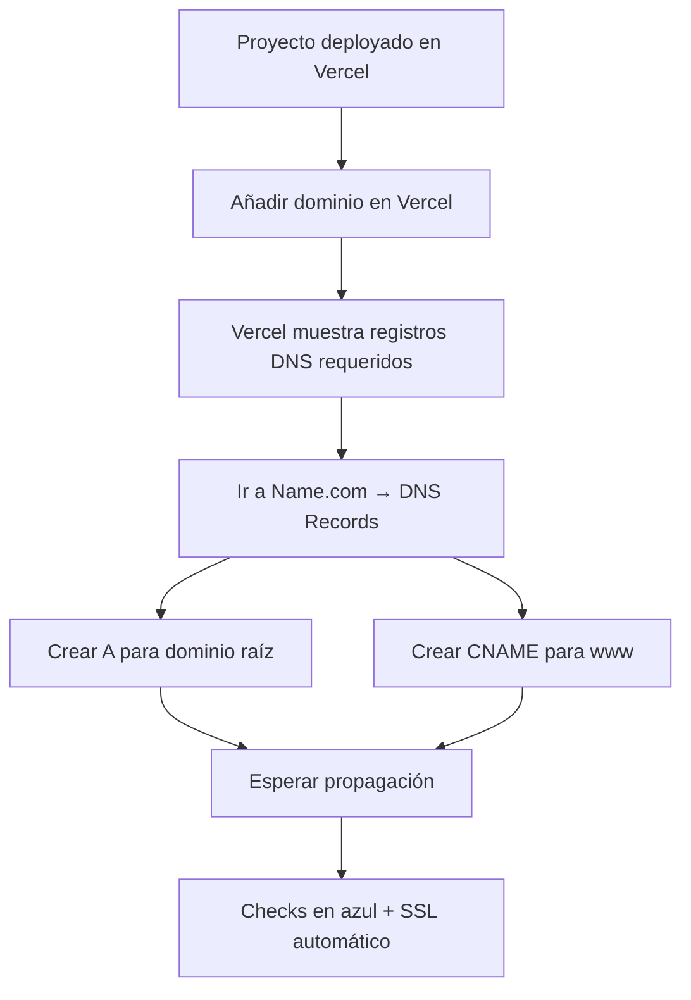

# 🚀 Guía 2: Configurar DNS de **Name.com** para **Vercel** (A + CNAME + SSL)

> Objetivo: conectar tu dominio comprado/canjeado en **Name.com** con tu proyecto en **Vercel**, dejando el **check en azul** (dominio verificado) y con **SSL activo**.

---

## ✅ Requisitos previos

1. 🌐 Tener un dominio activo en **Name.com** (por ejemplo, desde la Guía 1).  
2. 📦 Tener tu proyecto **deployado en Vercel** (desde GitHub o subido manualmente).  
3. 🔐 Acceso a:
   - Panel de **Vercel**
   - Panel de **Name.com** (DNS)


---

## 🧭 Vista general del flujo (diagrama)



---

## 1) 📦 Tener tu proyecto listo en Vercel

Si aún no lo tienes, primero crea un proyecto en Vercel desde GitHub y despliega (Deploy).


---

## 2) 🌐 Agregar el dominio en Vercel

### Paso 1 — Ir a “Domains” del proyecto
1. Entra a tu proyecto en Vercel.
2. Ve a: **Settings → Domains**.


### Paso 2 — Click en “Add Domain”
1. Presiona **Add Domain** (Añadir dominio).
2. Elige **Add existing domain** (o similar), como mencionas en tu guía.


### Paso 3 — Escribir tu dominio y guardar
1. Pega tu dominio (ejemplo: `ejemplo.dev`).
2. Click en **Add / Save**.


---

## 3) 🧾 Entender los registros que te pide Vercel (A y CNAME)

Luego de agregar el dominio, Vercel mostrará un panel con checks (al inicio suelen estar **en rojo**).  
Ahí verás **qué registros DNS debes crear**.

### ✅ Qué significa cada registro

#### A record (dominio raíz)
- Aplica para el dominio **sin “www”**:  
  `ejemplo.dev`
- Se usa para apuntar el dominio a una **IP** (la que te da Vercel para tu proyecto).

En Name.com normalmente el “host” se coloca como:
- `@` (o vacío) para representar el dominio raíz.

#### CNAME (subdominio www)
- Aplica para:  
  `www.ejemplo.dev`
- Se usa para apuntar `www` hacia el destino que indique Vercel (normalmente algo tipo `cname.vercel-dns.com`).

📌 **IMPORTANTE 🔒**  
No compartas públicamente (capturas o texto) los valores exactos que te muestra Vercel si no es necesario.  

---

## 4) 🛠️ Crear los DNS Records en Name.com

### Paso 4 — Ir a DNS en Name.com
1. Entra a Name.com.
2. Ve a tu dominio: **My Domains**.
3. Abre **Manage DNS / DNS Records** (gestionar registros DNS).


---

## 5) ✅ Crear el registro A (dominio raíz)

En la sección de DNS Records:

1. **Type:** `A`  
2. **Host / Name:** `@` (o vacío, según Name.com)  
3. **Answer / Value:** pega la **IP** que te da Vercel  
4. **TTL:** deja el recomendado (por defecto)  
5. Guarda


---

## 6) ✅ Crear el registro CNAME (www)

Ahora crea el registro para `www`:

1. **Type:** `CNAME`  
2. **Host / Name:** `www`  
3. **Answer / Value:** pega el valor CNAME que te indica Vercel (por ejemplo `cname.vercel-dns.com`)  
4. **TTL:** default  
5. Guarda


---

## 7) 🔁 Esperar propagación y validar en Vercel

### Paso 7 — Volver a Vercel y revisar checks
1. Regresa a **Vercel → Settings → Domains**.
2. Espera a que los checks cambien de rojo a **azul** ✅.

⏳ La propagación puede tomar desde minutos hasta algunas horas (depende del TTL y DNS).


---

## 8) 🌍 Elegir tu dominio principal (www vs raíz)

Vercel te permite decidir si tu producción será:
- `ejemplo.dev` (sin www) como principal, y `www` redirige
- `www.ejemplo.dev` como principal, y el raíz redirige

✅ Recomendación práctica:
- Usa **sin www** como principal si quieres simple.
- Usa **www** como principal si te interesa consistencia “clásica”.


---

## 9) 🧪 Validación rápida (opcional)

### En Windows / PowerShell
```bash
nslookup ejemplo.dev
nslookup www.ejemplo.dev
```

### Con `dig` (WSL / Git Bash)
```bash
dig ejemplo.dev +short
dig www.ejemplo.dev +short
```

---

## 🧯 Errores comunes y solución

- **Los checks siguen rojos**
  - Revisa que el `A` esté en `@` (raíz) y el `CNAME` en `www`.
  - Asegúrate de no tener registros duplicados/conflictivos (otro A para @, otro CNAME raro para www).

- **Propagación lenta**
  - Espera un poco y vuelve a intentar.
  - No edites y borres registros repetidamente (reinicia tiempos de propagación).

- **SSL no aparece**
  - En Vercel normalmente el SSL se activa solo cuando el dominio está verificado.
  - Si ya está verificado, espera unos minutos.

