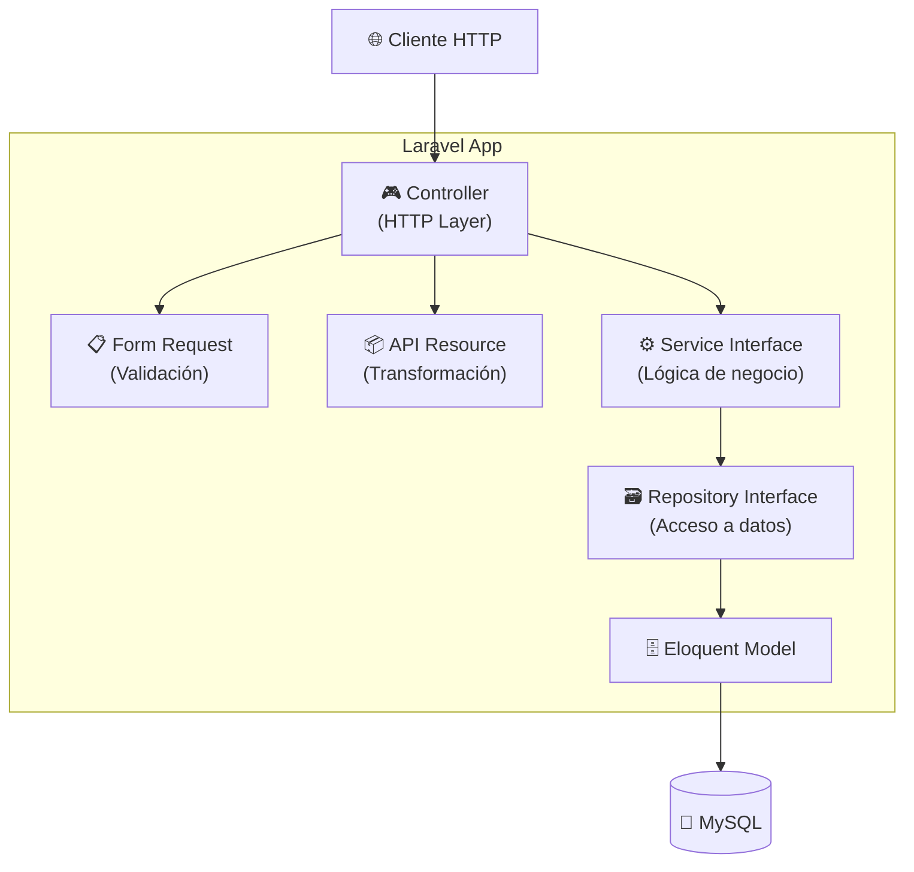
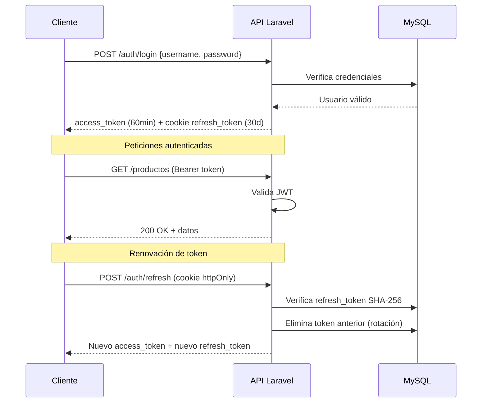
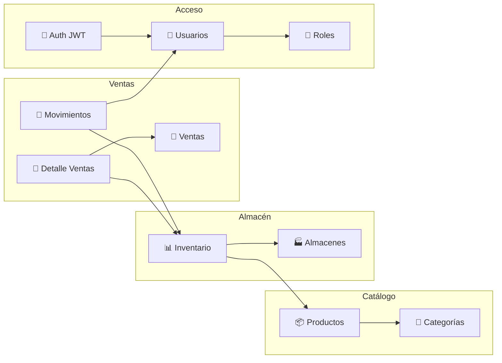
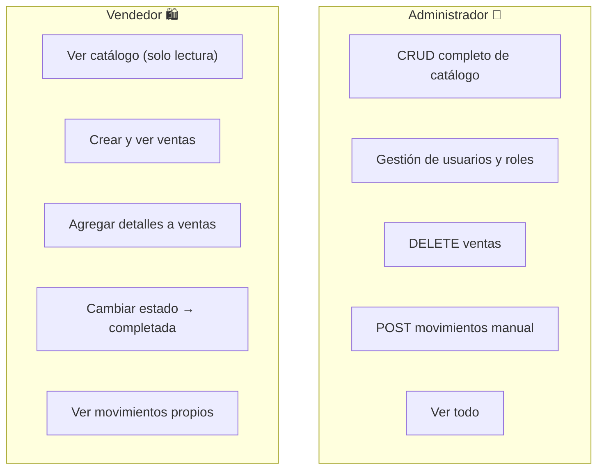
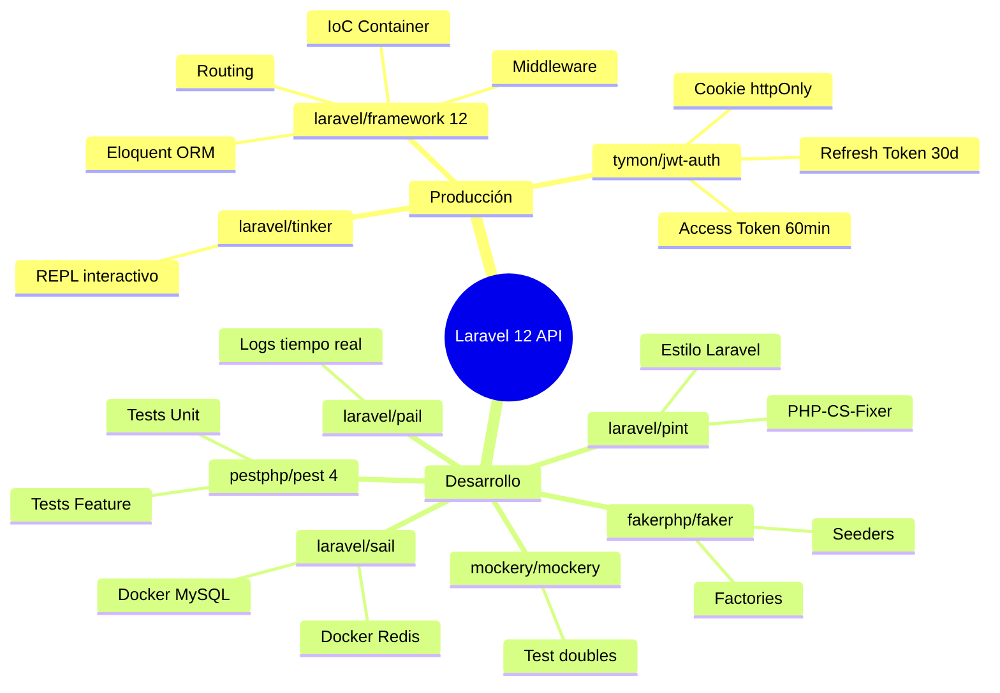
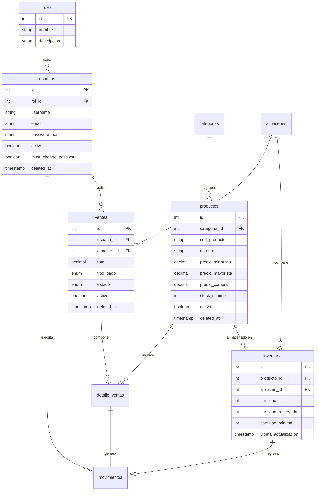

# 🏗️ Stack Técnico — Laravel Inventario API

> Documento de referencia técnica sobre todas las herramientas, librerías y decisiones arquitectónicas que conforman la **API REST de Inventario** construida con Laravel 12.

---

## 📋 Resumen del Proyecto

| Campo | Detalle |
|-------|---------|
| **Nombre** | Laravel Inventario API |
| **Tipo** | REST API — Backend puro |
| **Framework** | Laravel 12 |
| **Lenguaje** | PHP 8.2+ |
| **Base de datos** | MySQL 8 (Docker) |
| **Autenticación** | JWT (tymon/jwt-auth) |
| **Documentación** | OpenAPI 3.0 / Swagger UI |
| **Deploy** | Vercel (PHP runtime) |
| **Repo** | [MILLERMARRU/learn_laravel](https://github.com/MILLERMARRU/learn_laravel) |

---

## 🧱 Arquitectura por Capas

El proyecto sigue un patrón estricto de capas para garantizar separación de responsabilidades, testabilidad e inversión de dependencias.



### 📁 Estructura de directorios clave

```
app/
├── Http/
│   ├── Controllers/        # Controladores REST
│   ├── Middleware/         # RoleMiddleware, etc.
│   └── Requests/           # Form Requests (validación)
├── Models/                 # Eloquent Models
├── Resources/              # API Resources (transformación JSON)
├── Services/
│   └── Contracts/          # Interfaces de servicios
├── Repositories/
│   └── Contracts/          # Interfaces de repositorios
└── Providers/
    └── RepositoryServiceProvider.php  # Bindings IoC
```

---

## 🚀 Dependencias de Producción

### 🐘 PHP

| Requisito | Versión |
|-----------|---------|
| **PHP** | `^8.2` |

Características de PHP 8.2+ usadas:
- **Readonly properties** en DTOs
- **Named arguments** para mayor claridad
- **Fibers** (soporte interno de Laravel)
- **Enums nativos** (`tipo_pago`, `estado` en ventas)

---

### 🔴 Laravel Framework `^12.0`

El núcleo del proyecto. Laravel 12 provee:

| Componente | Uso en el proyecto |
|------------|--------------------|
| **Eloquent ORM** | Todos los modelos, relaciones, soft deletes |
| **Routing** | `Route::apiResource()` con parámetros customizados |
| **Service Container (IoC)** | Binding de interfaces → implementaciones concretas |
| **Middleware** | Auth JWT, RoleMiddleware |
| **Migrations** | Esquema completo de 8 tablas |
| **Seeders** | Datos de prueba + `ProductionSeeder` idempotente |
| **Artisan CLI** | Comandos de scaffolding y mantenimiento |
| **Queue** | Soporte para jobs asíncronos |
| **Events & Listeners** | Sistema de eventos desacoplado |

```bash
# Instalar Laravel 12
composer create-project laravel/laravel example-app "^12.0"
```

---

### 🔑 tymon/jwt-auth `*`

Autenticación stateless mediante **JSON Web Tokens**.



**Configuración clave:**

```php
// config/auth.php
'guards' => [
    'api' => [
        'driver'   => 'jwt',
        'provider' => 'usuarios',
    ],
],
'providers' => [
    'usuarios' => [
        'driver' => 'eloquent',
        'model'  => App\Models\Usuario::class,
    ],
],
```

```bash
# Publicar config y generar secret
php artisan vendor:publish --provider="Tymon\JWTAuth\Providers\LaravelServiceProvider"
php artisan jwt:secret
```

**Variables de entorno:**

```env
JWT_SECRET=tu_secret_aqui
JWT_TTL=60           # Access token: 60 minutos
REFRESH_TOKEN_TTL=43200  # Refresh token: 30 días
```

---

### 🛠️ laravel/tinker `^2.10.1`

REPL interactivo para explorar y depurar la aplicación en tiempo real.

```bash
php artisan tinker

# Ejemplos de uso
>>> App\Models\Usuario::find(1)->load('rol')
>>> App\Models\Producto::where('activo', true)->count()
>>> Hash::make('Password123!')
```

---

## 🔧 Dependencias de Desarrollo

### 🎭 fakerphp/faker `^1.23`

Generación de datos falsos para factories y seeders.

```php
// database/factories/ProductoFactory.php
public function definition(): array
{
    return [
        'cod_producto'       => fake()->unique()->bothify('PROD-####'),
        'nombre'             => fake()->words(3, true),
        'marca'              => fake()->company(),
        'precio_minorista'   => fake()->randomFloat(2, 10, 500),
        'precio_mayorista'   => fake()->randomFloat(2, 5, 400),
        'stock_minimo'       => fake()->numberBetween(5, 50),
    ];
}
```

---

### 🚢 laravel/sail `^1.41`

Entorno de desarrollo Docker para Laravel. Orquesta contenedores de:
- **PHP-FPM** con todas las extensiones necesarias
- **MySQL 8**
- **Redis**
- **Mailpit** (testing de emails)

```bash
# Levantar el entorno completo
./vendor/bin/sail up -d

# Ejecutar comandos dentro del contenedor
./vendor/bin/sail artisan migrate
./vendor/bin/sail artisan db:seed
./vendor/bin/sail php artisan tinker
```

---

### ✨ laravel/pint `^1.24`

Formateador de código PHP basado en **PHP-CS-Fixer**. Hace cumplir el estilo de código de Laravel.

```bash
# Formatear todos los archivos PHP
./vendor/bin/pint

# Solo verificar sin modificar
./vendor/bin/pint --test

# Formatear un archivo específico
./vendor/bin/pint app/Models/Usuario.php
```

```json
// pint.json (configuración)
{
    "preset": "laravel",
    "rules": {
        "ordered_imports": true,
        "no_unused_imports": true
    }
}
```

---

### 📡 laravel/pail `^1.2.2`

Visor de logs en tiempo real en la terminal. Alternativa moderna a `tail -f storage/logs/laravel.log`.

```bash
# Ver todos los logs en tiempo real
php artisan pail

# Filtrar por nivel
php artisan pail --level=error

# Filtrar por mensaje
php artisan pail --filter="JWT"
```

---

### 💥 nunomaduro/collision `^8.6`

Mejora la presentación de errores en la consola con stack traces legibles y coloreados. Se activa automáticamente al correr tests con `php artisan test`.

---

### 🎭 mockery/mockery `^1.6`

Framework de mocking para PHP. Usado junto con Pest para crear dobles de prueba.

```php
// Ejemplo de mock en test
$repository = Mockery::mock(ProductoRepositoryInterface::class);
$repository->shouldReceive('findById')
           ->with(1)
           ->andReturn($producto);
```

---

### 🐛 laravel/boost `2.0`

Herramienta de desarrollo de Laravel que provee helpers adicionales para el flujo de trabajo. Incluye mejoras para la experiencia de desarrollo local.

---

### 🧪 pestphp/pest `^4.4` + pestphp/pest-plugin-laravel `^4.1`

Framework de testing moderno con sintaxis expresiva. Reemplaza la API de PHPUnit con una más legible.

```php
// tests/Feature/ProductoTest.php
it('puede crear un producto', function () {
    $payload = [
        'cod_producto'     => 'PROD-001',
        'nombre'           => 'Laptop HP',
        'categoria_id'     => 1,
        'precio_minorista' => 1500.00,
        'precio_mayorista' => 1200.00,
        'stock_minimo'     => 5,
    ];

    $this->actingAs($this->admin, 'api')
         ->postJson('/api/v1/productos', $payload)
         ->assertStatus(201)
         ->assertJsonPath('data.cod_producto', 'PROD-001');
});

it('rechaza crear producto con código duplicado', function () {
    Producto::factory()->create(['cod_producto' => 'PROD-001']);

    $this->actingAs($this->admin, 'api')
         ->postJson('/api/v1/productos', ['cod_producto' => 'PROD-001', ...])
         ->assertStatus(422);
});
```

```bash
# Correr todos los tests
php artisan test

# Con cobertura de código
php artisan test --coverage

# Solo un archivo
php artisan test tests/Feature/ProductoTest.php

# En paralelo
php artisan test --parallel
```

---

## 🐳 Infraestructura y Entorno

### Docker + MySQL 8

```yaml
# docker-compose.yml (sail)
services:
  mysql:
    image: mysql/mysql-server:8.0
    ports:
      - '${FORWARD_DB_PORT:-3302}:3306'
    environment:
      MYSQL_DATABASE: ${DB_DATABASE}
      MYSQL_USER: ${DB_USERNAME}
      MYSQL_PASSWORD: ${DB_PASSWORD}
    volumes:
      - sail-mysql:/var/lib/mysql
```

```env
DB_CONNECTION=mysql
DB_HOST=127.0.0.1
DB_PORT=3302
DB_DATABASE=laravel
DB_USERNAME=sail
DB_PASSWORD=password
```

---

### 🌐 CORS — fruitcake/php-cors

Configurado para permitir peticiones del frontend SPA.

```php
// config/cors.php
return [
    'paths'               => ['api/*'],
    'allowed_methods'     => ['*'],
    'allowed_origins'     => [env('FRONTEND_URL', 'http://localhost:3000')],
    'allowed_headers'     => ['*'],
    'supports_credentials' => true,  // necesario para cookies httpOnly
];
```

---

## 📐 Módulos Implementados



| Módulo | Tipo delete | Endpoint base |
|--------|-------------|---------------|
| Categorías | Hard delete (409 si tiene productos) | `/api/v1/categorias` |
| Productos | Soft delete | `/api/v1/productos` |
| Almacenes | Soft delete | `/api/v1/almacenes` |
| Inventario | Hard delete | `/api/v1/inventarios` |
| Roles | Hard delete (409 si tiene usuarios) | `/api/v1/roles` |
| Usuarios | Soft delete | `/api/v1/usuarios` |
| Ventas | Soft delete | `/api/v1/ventas` |
| Detalle Ventas | Sin delete (auditoría) | `/api/v1/ventas/{venta}/detalles` |
| Movimientos | Sin delete (auditoría) | `/api/v1/movimientos` |
| Auth | — | `/api/v1/auth` |

---

## 🔐 Permisos por Rol



---

## ⚡ Comandos de Desarrollo

```bash
# ── Configuración inicial ────────────────────────────────
composer install
cp .env.example .env
php artisan key:generate
php artisan jwt:secret

# ── Base de datos ────────────────────────────────────────
php artisan migrate                    # Crear tablas
php artisan migrate:fresh --seed       # Reset + datos de prueba
php artisan db:seed --class=ProductionSeeder  # Seed de producción

# ── Servidor de desarrollo ───────────────────────────────
php artisan serve                      # http://localhost:8000
composer dev                           # servidor + queue + vite concurrentes

# ── Testing ──────────────────────────────────────────────
php artisan test
php artisan test --parallel
php artisan test --coverage --min=80

# ── Calidad de código ────────────────────────────────────
./vendor/bin/pint                      # Formatear código
php artisan pail --level=error         # Ver logs de error en tiempo real

# ── Documentación ───────────────────────────────────────
# Swagger UI disponible en http://localhost:8000/docs (solo APP_ENV=local)
```

---

## 📦 Resumen de Dependencias



---

## 🗄️ Esquema de Base de Datos



---

> 📌 **Credenciales de prueba**
> 
> | Usuario | Rol | Password |
> |---------|-----|----------|
> | `miller` | Administrador | `Password123!` |
> | `sam` | Administrador | `Password123!` |
> | `carlos` | Vendedor | `Password123!` |
> | `lucia` | Vendedor | `Password123!` |
